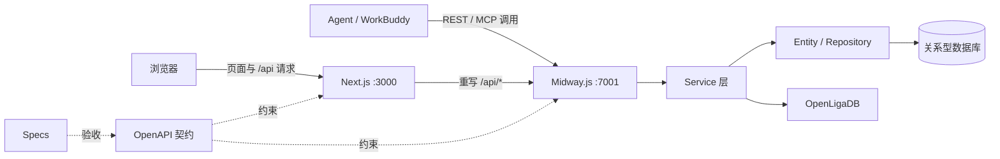

# 系统架构

## 设计边界

- `frontend` 负责页面渲染、交互状态和用户体验。
- `backend` 负责 HTTP 边界、业务规则、权限、并发控制和数据持久化。
- `contracts` 是前后端共同遵守的接口事实来源。
- `specs` 说明为什么做、为谁做，以及如何判断完成。
- Agent、Skill 或 MCP Tool 是普通调用方，必须复用同一 REST 契约，不能绕过鉴权或业务规则。

功能开发遵循 `specs → contracts → frontend/backend → test/check`。涉及用户可见行为、HTTP 行为、权限、排序、分页、并发或数据语义时，先更新 Spec 和 OpenAPI，再实现代码。

## 核心业务模型

- Competition 表示赛事或联赛。
- Stage 表示赛事阶段，类型为 `GROUP`、`LEAGUE` 或 `KNOCKOUT`。
- Match 是唯一比赛模型。Prediction、Favorite、Comment 都关联 Match。
- `GROUP` 和 `LEAGUE` 复用积分榜计算逻辑；`KNOCKOUT` 使用 round / bracket 展示淘汰赛图。
- 比赛状态只包括未开始、进行中、已结束。预测锁定必须由服务端根据比赛开始时间判断。

## 请求链路

开发环境中，浏览器请求 Next.js 的 `/api/*`。Next.js 按 `BACKEND_INTERNAL_URL` 将请求重写到 Midway。这样本地开发和部署都保持同源请求，后端无需放宽 CORS。

Agent 或测试工具也可直接请求 Midway，例如 `http://localhost:7001/api/health`。所有业务请求都必须符合 `contracts/openapi.yaml`。

## 数据策略

最终交付要求使用关系型数据库并可通过 Docker 一条命令启动前端、后端和数据库。本地骨架阶段默认数据库路径为 `backend/data/football-platform.sqlite`，数据库文件不进入版本控制。

后端实现应保持 Controller → Service → Entity/Repository 分层。Service 保留业务规则、流程编排、权限判断和事务边界；Repository 负责持久化查询和实体映射。
